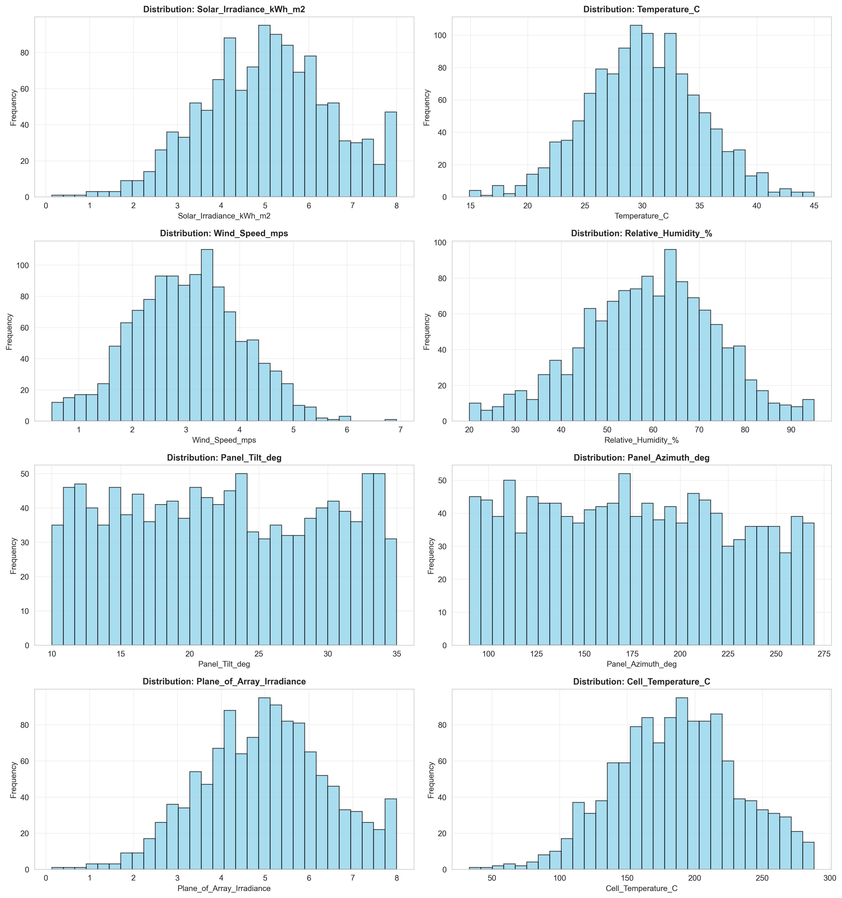
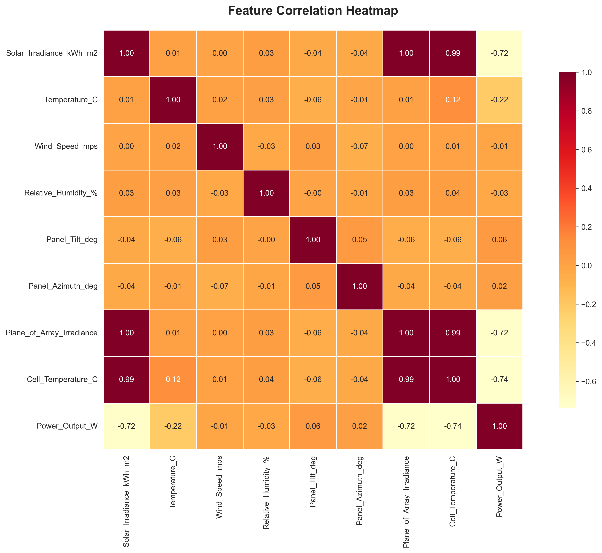
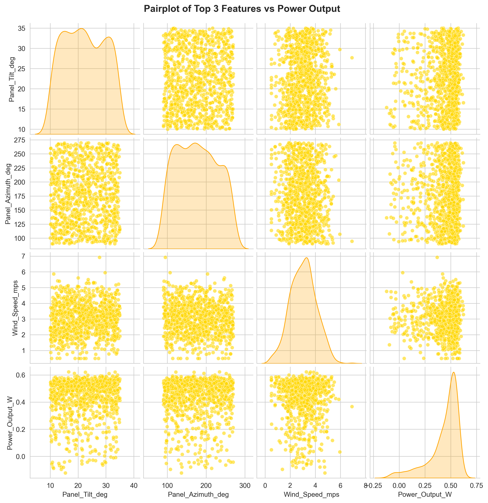

# 🌞 Solar PV Digital Twin — Advanced ML Dashboard & API

A production-grade machine learning system for **Solar PV Power Output Prediction**, complete with:

- 🤖 **ML Training Pipeline** (training_enhanced.py)
- 🌐 **FastAPI Prediction Server** (server.py)
- 🎨 **Modern Streamlit Dashboard** (app_enhanced.py)
- 📊 **EDA + Model Visualizations**
- 🧪 **Batch CSV Prediction**
- 🔴 **Live Digital Twin Simulation**
- 📁 **Industry-level Project Structure**

---

## 📸 Website UI — Screenshots

### 🟦 Dashboard Overview


### 🟩 Manual Predictor


### 🟧 Live Digital Twin Simulation


### 🟪 Batch CSV Predictions


---

## 📊 EDA & Model Visualizations

### 🔹 Feature Distributions


### 🔹 Correlation Heatmap


### 🔹 Pairplot (Top Features)


---

## 🧠 Project Summary

This Solar PV Digital Twin predicts **instantaneous power output (W)** using:

- Solar irradiance  
- Temperature  
- Wind speed  
- Humidity  
- Plane of array irradiance  
- Cell temperature  
- Panel tilt & azimuth  

The system integrates **ML + API + UI** to simulate real-world solar plant monitoring, forecasting, and analysis.

---

## 🧮 Model Performance

| Metric | Value |
|--------|-------|
| MAE | **0.0 W** |
| MAPE | **4.93%** |
| R² Score | **0.9982** |
| Max Error | **0.05 W** |

Artifacts stored in:
```
models/pipeline_prod.joblib
models/metrics.json
```

---

## 🏗️ System Architecture

```
data/  → preprocessing → training_enhanced.py
          ↓
models/pipeline_prod.joblib
          ↓
FastAPI server (server.py)
          ↓
Streamlit Dashboard (app_enhanced.py)
```

---

## 🚀 Quick Start

### 1️⃣ Create Environment  
```bash
python -m venv venv
.\venv\Scripts\Activate.ps1
pip install -r requirements.txt
```

### 2️⃣ Train Model  
```bash
python src/training/training_enhanced.py
```

### 3️⃣ Start API Server  
```bash
uvicorn src.server:app --reload
```

### 4️⃣ Launch Dashboard  
```bash
streamlit run src/app_enhanced.py
```

---

## 🔌 API Endpoints

### POST /predict  
JSON → single power output prediction

### POST /predict_batch  
Upload CSV → returns full predictions CSV/JSON

### GET /health  
Health check

### GET /model  
Model metadata + metrics

---

## 📂 Project Structure

```
solar-pv-project/
│
├─ data/
├─ models/
│   ├─ pipeline_prod.joblib
│   ├─ metrics.json
│   └─ visualizations/
│
├─ src/
│   ├─ app_enhanced.py
│   ├─ server.py
│   ├─ training/
│   │   └─ training_enhanced.py
│   ├─ inference/
│   └─ utils/
│
├─ tests/
├─ requirements.txt
└─ README.md
```

---

## 🧩 Production Checklist

- ✔ Pre-commit formatting (Black + Flake8)  
- ✔ Configurable training pipeline  
- ✔ FastAPI endpoint validation  
- ✔ Streamlit modular UI  
- ✔ Ready for Docker deployment  
- ✔ GitHub-friendly directory structure  

---

## 👨‍💻 Author

**Dhruv Bansal**  
ML Engineer • Dashboard Developer • Final Year EEE  

---

## 📬 Contact  
📧 Email: add-your-email  
🌐 GitHub: https://github.com/dbansal0607

---

